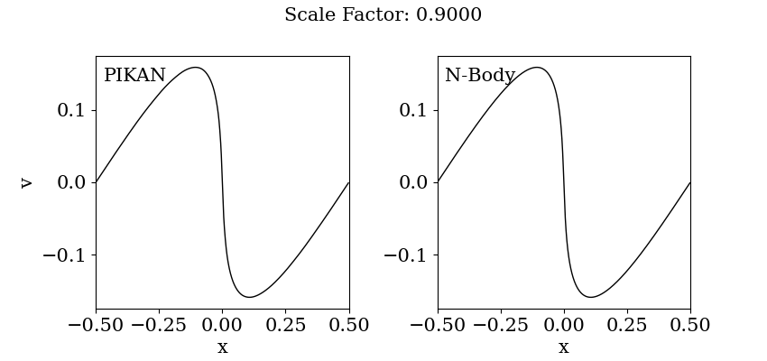

# cdm-pikan
Cold Dark Matter simulations with physics-informed Kolmogorov-Arnold Networks.

## Context
In traditional N-body cosmological simulations, we discretize the distribution function of the cold dark matter into a set of Diracs (particles), that leads to discreteness errors.
We here instead use a [Kolmogorov-Arnold Network](https://arxiv.org/abs/2404.19756) to emulate the displacement field, only using the collisionless cosmological Vlasov-Poisson equations.

## Requirements :clipboard:

You need to have the [JaxKAN](https://github.com/srigas/jaxKAN) package installed.

## Launch a training :rocket:

For a short test/debug training, you can use the [demo notebook](https://github.com/nicolas-cerardi/cdm-pikan/blob/main/notebooks/demo_training.ipynb).


For a long training, you may use the python script:

```
cd scripts
python3 train_dm1d_jaxKAN_sequential --flagfile=../configs/jaxkan_sequential_pde2_base.cfg
 ```

## Comparison with N-body :mag_right:


